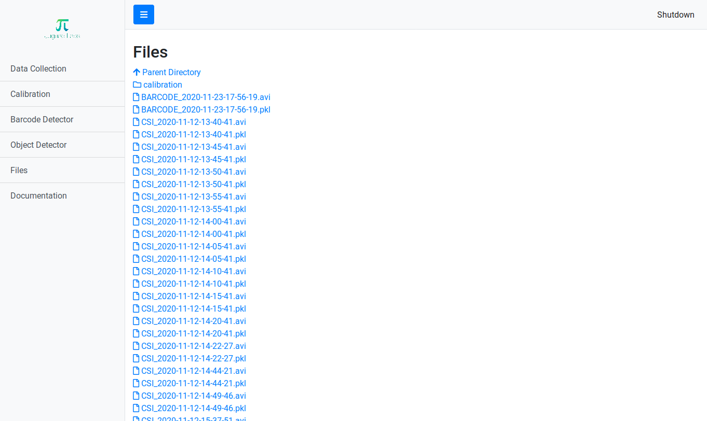
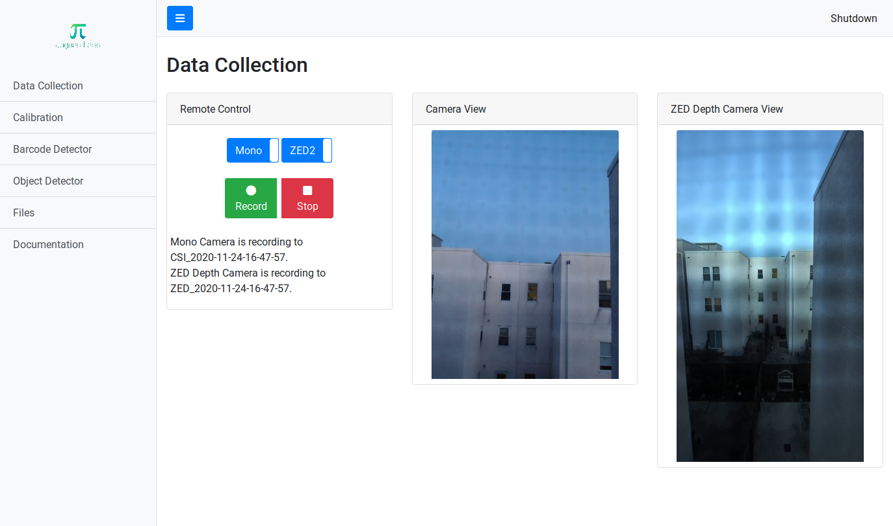
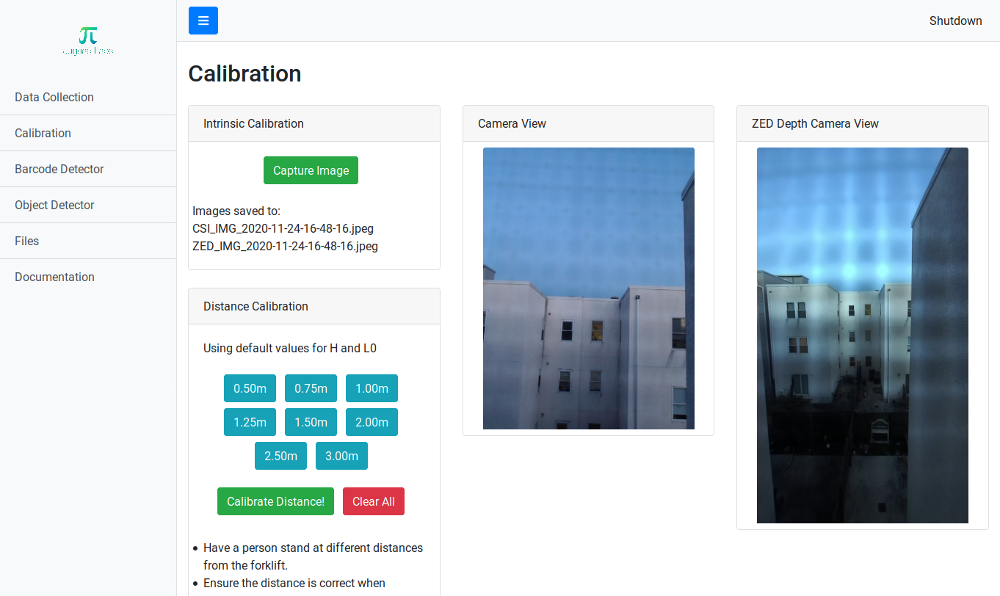
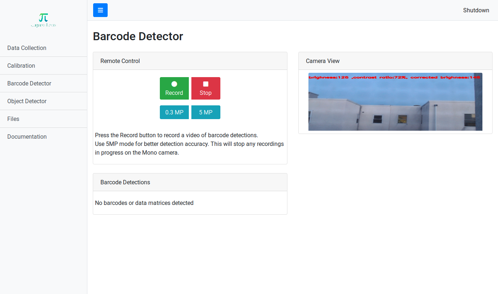
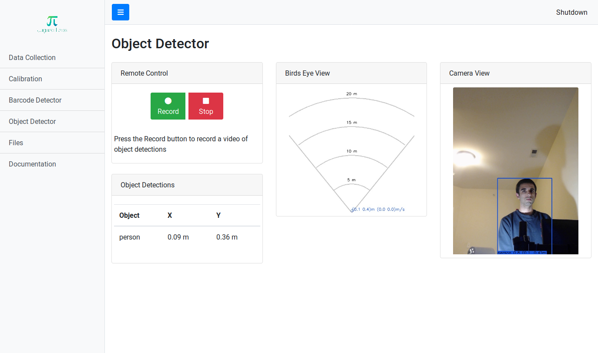

## Introduction

This project allows one to remotely record timestamped video data from a V4L2 camera and the ZED stereo camera simultaneously. It targets the NVIDIA Jetson Xavier, but should work fine with any computer with an NVIDIA graphics card which supports the ZED camera. If you don't have the ZED camera attached or `pysdk` installed, the server falls back to serving a video stream from a V4L2 device. It has been tested to work on the Raspberry Pi for streaming video using the Raspberry Pi camera.

A video tutorial of using the dashboard can be found [here](https://youtu.be/_Sp9WvgxLE0).

## Install

Switch the Jetson Xavier NX to using 15W 6 Core mode for the best performance:

```
sudo nvpmodel -m 2
```

Download the project using:

```
git clone https://github.com/JugaadLabs/webserver.git
```

Install the Python dependencies by running:

```
pip3 install -r requirements.txt
```

Install the ZED Python SDK using the instructions [here](https://www.stereolabs.com/docs/app-development/python/install/).

**Optional**: Autogenerate the `documentation.html` page by running:

```
pandoc README.md -o templates/documentation.html
```

## Usage

This project uses a CherryPy webserver for remotely receiving commands using HTTP GET calls. Make sure your Xavier NX is running Jetpack 4.4 Developer Preview for use with the e-Con camera. The e-Con camera is a V4L2 device and you can find which device it is by checking the output of `v4l2-ctl --list-devices`.

### Server

On the NVIDIA Jetson, the server can be started directly by using:

```
./jetsonStart.sh
```

Otherwise start the webserver by running:

```
python3 webserver.py <INTERFACE='lo'> <PORT=8000> <RECORDING_DIR='.'> <V4L2_DEVICE=-1>
```

The `interface` argument is the network interface on which you want to run the webserver. Examples include `wlan0`, `lo`, and `l4tbr0` on the NVIDIA Jetson. The web server serves the page based on the IP address of the interface. The `RECORDING_DIR` argument is for choosing the folder to save the videos and images recorded by the cameras. The folder will be created if it doesn't already exist. The AR0591 camera module or any V4L2 webcam is auto-detected by default, but can also be specified in an argument. An example launch command where the camera is connected on `/dev/video1` is:

```
python3 webserver.py wlan0 8000 /home/nvidia/recordings 1
```

Now go to the address where the webserver is serving pages (e.g. http://192.168.55.1:8000) in your web browser. This loads a webpage with the options to control the cameras, take pictures for calibration, download files, and view documentation.

On recording a video, the videos will record to the specified location in the arguments. Each recording over 5 minutes is split into multiple files each 5 minutes long. Images captured for calibration are saved to `RECORDING_DIR/calibration`. Every file is timestamped.

## Features

The webserver provides the following bespoke features:

### File Browser



This utility allows the user to download files directly from the server. Clicking on a file opens an option to download it to the device. The rest of the utilities can be accessed from the sidebar. Press the blue hamburger icon at the top left corner to open or close the sidebar.

### Data Collection



This utility allows the user to record data from the Mono camera and the ZED depth camera simultaneously. Slide the toggle switch to apply the "Record" or "Stop" button on either one, or both of the cameras. By default, both cameras will record simultaneously. In case the ZED depth camera is not connected, only the view from the Mono camera will be shown. To reduce the chances of data corruption, a new file is created every five minutes when recording video.

The recorder records the video in the AVI file format. Each frame of the video is timestamped. The timestamps can be found in the Pickle file with the same filename as the video. Refer to `analysis/dataprocess.ipynb` for processing these files.

### Intrinsic Calibration



This utility allows the user to capture pictures from the Mono camera and the ZED depth camera simultaneously for the purposes of intrinsic calibration. Press the "Capture Image" button to take a picture with both cameras. In case the ZED depth camera is not connected, only the view from the Mono camera will be shown.

### Barcode Detector



This utility allows the user to read barcodes and record the video feed and the barcode data to a file. The barcodes are scanned in realtime and the detected values can be seen in the Barcode Detections panel. The user can use the Recording and Stop button to record an AVI file and an accompanying Pickle file with the same filename as the video. This Pickle file will have data about the barcodes detected at each frame with the timestamp.

### Object Detector



This utility allows the user to detect objects in realtime and record the video feed and the detected objects data to a file. The objects are processed in realtime and the detected values can be seen in the Object Detections panel. Currently three classes the classifier can detect - person, forklift, and pallet. The Birds Eye View panel gives a visual indication of the position of the objects with respect to the camera.

 The user can use the Recording and Stop button to record an AVI file and an accompanying Pickle file with the same filename as the video. This Pickle file will have data about the objects detected at each frame, their relative positions with respect to the camera, and the timestamp.

## Settings

All the settings for all the utilities in this project can be adjusted by modifying `settings.py`.

## Recordings

The data from the ZED camera is saved in the SVO format. Instructions for processing this data can be found [here](https://www.stereolabs.com/docs/video/recording/). The SVO file can be converted to an AVI file for color and depth using the `svo2avi.py` script in the `analysis/` folder of the project.

Video from the V4L2 camera is saved to a timestamped `.avi` file. The UNIX timestamp for each frame of the video can be found in its accompanying `.pkl` file which contains a list of timestamps, one for each frame of the video. Please refer to the `analysis/dataprocess.ipynb` Jupyter notebook for processing the `.avi`, `.pkl`, `.svo` files.
